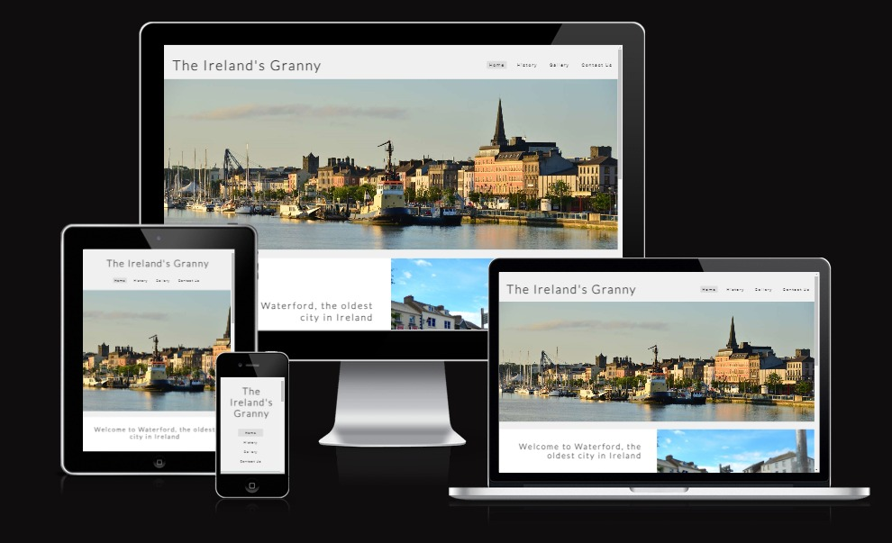
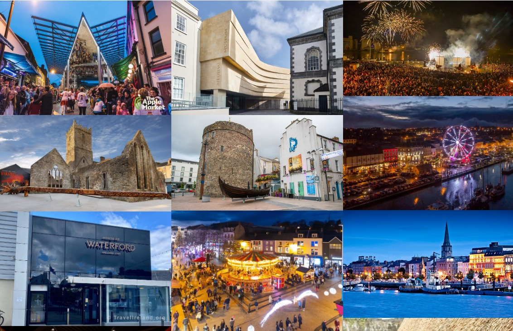
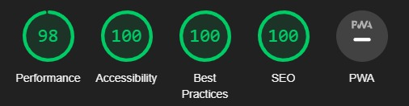

# The Ireland's Granny

Welcome to "The Ireland's Granny," your portal to explore Waterford, Ireland's oldest city. Uncover its Viking origins, medieval prosperity, and modern cultural revival. Immerse yourself in the art, architecture, and traditions that define Waterford's unique story.

### Discover Waterford's History:

Step into the past with us as we uncover Waterford's rich history. Founded by Vikings, this city carries the legacy of trade and heritage. From medieval roots to a vibrant present, experience the essence of Waterford's journey through time.

## Existing Features

### Navigation Bar:
The website features a top navigation bar that allows visitors to easily access different sections of the site. The navigation bar includes links to the home page, the history page, the image gallery, and the contact us page.

### Hero Image:
On the home page, a stunning hero image is displayed in fullscreen or prominently, capturing the essence and atmosphere of the city of Waterford. The hero image serves as a striking visual introduction to the site and creates an immediate impact.

### Main Page with Waterford Details:
The main page provides an overview of the key highlights and details of Waterford city. 

### Footer:
The site's footer contains links to the site's social media profiles, such as Facebook, Twitter, YouTube, and Instagram. This enables visitors to follow and engage with the site on social media platforms.

### City History Page:
The page dedicated to the city's history offers a detailed narrative of Waterford's rich history. It spans from its Viking origins to its evolution over the centuries, highlighting significant moments and cultural and economic transformations.

### Image Gallery:
The image gallery showcases a collection of photos and images related to the city of Waterford. This allows visitors to visually explore the city's landmarks, landscapes, and attractions.

### Signup Page:
The signup page likely provides a way for visitors to subscribe to receive updates, news, or offers related to the site. This page may include a signup form with fields for name, email, and other relevant information.

## Browser Compatibility

I have tested my website on various browsers to ensure a consistent and optimal user experience across different platforms. The website is fully compatible with the following web browsers:

- Google Chrome
- Mozilla Firefox
- Opera
- Microsoft Edge

During testing, I verified that the layout, responsiveness, and functionality of the website remain consistent and functional across these browsers. Users can access the site seamlessly using their preferred web browser.

## Code Validation

I've taken steps to ensure the quality and standards compliance of my website's HTML and CSS code. Here are the validation results:

- **HTML Validation:** I've validated my HTML code using the W3C HTML Validator. The code has been reviewed and conforms to the HTML5 standard without errors or warnings.

- **CSS Validation:** I've also validated my CSS code using the W3C CSS Validator. The stylesheet is compliant with CSS3 standards and doesn't have any errors or issues.

During the CSS validation process, a single error was identified. This error pertains to the inclusion of Font Awesome icons within the CSS file. The Font Awesome declarations were flagged as potentially invalid according to CSS3 specifications. However, it's important to note that this error can be safely disregarded, as Font Awesome icons are widely used and have been thoroughly tested for compatibility.

- **Accessibility:** I've taken accessibility seriously during the development of my website to ensure that it is usable by a wide range of users, including those with disabilities. Here are the steps I've taken:

## Deployment

The site was deployed to GitHub pages. The steps to deploy are as follows:

- *In the GitHub repository, navigate to the Settings tab* 

- *From the source section drop-down menu, select the Master Branch*

- *Once the master branch has been selected, the page will be automatically refreshed with a detailed ribbon display to indicate the successful deployment.*

The live link can be found here - [Go to live website](https://lucaspbj.github.io/project-milestone-1/)

